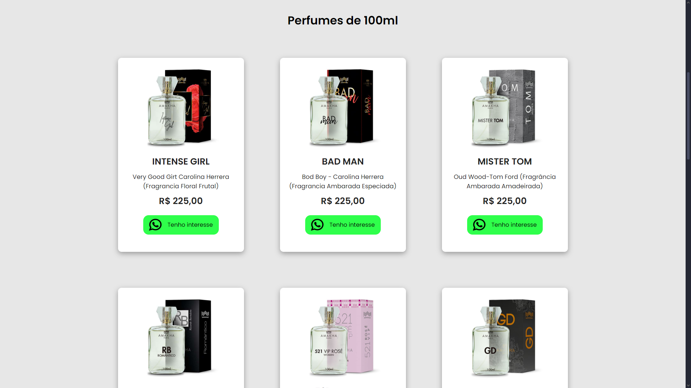
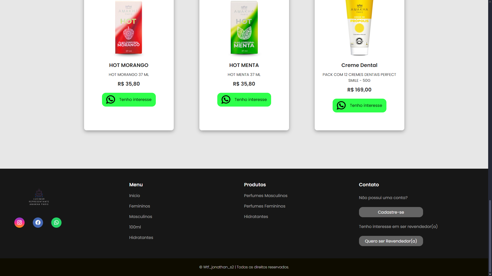

<h1>PerfumeShop</h1>
  

## Tópicos

 • <a href="#-sobre-o-projeto">Sobre o Projeto</a>  
 • <a href="#-tecnologias">Tecnologias</a>  
 • <a href="#-layout">Layout</a>  
 • <a href="#-funcionalidades">Funcionalidades</a>  
 • <a href="#-autor">Autor</a>  
 • <a href="#user-content--licença">Licença</a> 

## Sobre o projeto  

O projeto de vendas de perfumes é um site desenvolvido para oferecer uma experiência intuitiva e agradável aos clientes que desejam comprar perfumes online. A plataforma permite a navegação por diversas categorias de fragrâncias, exibição de produtos com imagens de alta qualidade e informações detalhadas sobre cada perfume, incluindo notas olfativas, marca e volume.

Além disso, o site conta com um design responsivo para garantir uma boa experiência tanto em dispositivos móveis quanto em desktops. O objetivo do projeto é facilitar a compra de perfumes de forma prática, segura e acessível, oferecendo uma interface moderna e funcionalidades úteis.

## Tecnologias

▪ HTML5 → Estrutura da interface. 
▪ CSS3 → Estilização e design responsivo. 
▪ JavaScript → Interatividade e dinamismo. 
▪ Firebase → Para autenticação e gerenciamento de usuários
## Layout

💻 Algumas telas da Aplicação Web!

  

  <h2 align=center> PERFUMES </h2>
  
  <h2 align=center>HIDRATANTES</h2>
  

## Funcionalidades

✔ Catálogo de perfumes com imagens de alta qualidade, descrições detalhadas e preços.  

✔ Sistema de pesquisa e filtros para encontrar fragrâncias por marca, tipo ou 
preço.  

✔ Sistema de login e cadastro para clientes.  

✔ Layout responsivo garantindo usabilidade em qualquer dispositivo.  

# Entre em contato

**Linkedin**: [LinkedIn](https://www.linkedin.com/in/jonathan-rubens-60975628a/)

Desenvolvido por **Jonathan Rubens** 👋🏻
